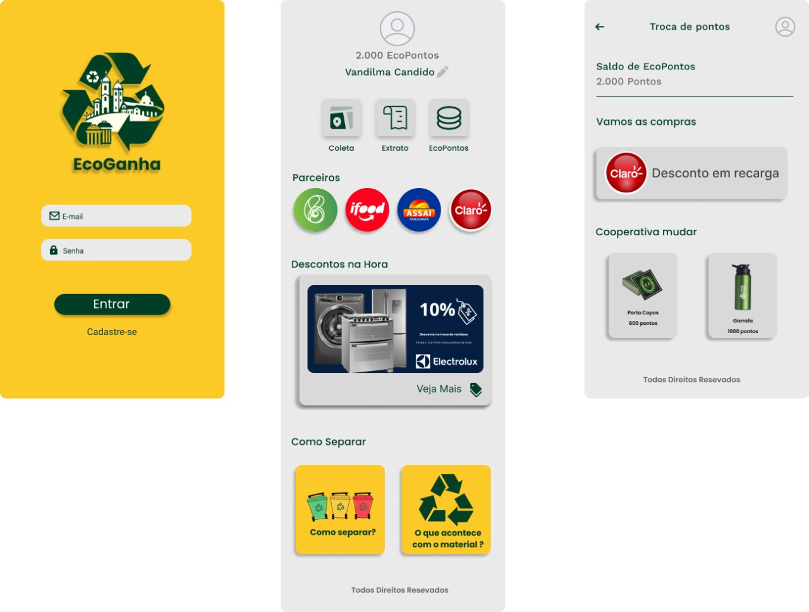

# EcoGanha 🌱

O **EcoGanha** é um aplicativo focado em promover a sustentabilidade, conectando a população, cooperativas de catadores e parceiros comerciais. Ele recompensa práticas conscientes de descarte e reciclagem de resíduos, incentivando hábitos ecológicos.

---

## 🌟 Funcionalidades Principais

### 1. **Cadastro e Login**
- Interface simples para que os usuários possam acessar suas contas.
- Garantia de segurança no armazenamento de dados.

### 2. **EcoPontos**
- Usuários acumulam pontos ao descartar resíduos corretamente ou apoiar cooperativas cadastradas.
- Saldo de pontos atualizado em tempo real.

### 3. **Troca de Pontos**
Rede de parceiros oferece benefícios variados:
- **Descontos** em recargas de celular (ex.: Claro).
- Benefícios em grandes redes, como **iFood** e **Assaí**.
- Descontos imediatos em eletrodomésticos e outros itens.
- Troca por brindes ecológicos, como garrafas reutilizáveis ou porta-copos.

### 4. **Educação Ambiental**
- Orientações visuais e práticas sobre separação de resíduos.
- Informações sobre o impacto positivo da reciclagem.

---

## 🛠️ Tecnologias Utilizadas

- **Frontend:** React, Next.js, Tailwind CSS

---

## 📱 Imagens do App

---

## 🌍 Como Funciona?

### 1. **Descartar Resíduos**
- O usuário realiza um check-in no app indicando onde os resíduos estão disponíveis para coleta.
- Os resíduos são encaminhados para cooperativas próximas.

### 2. **Acumular Pontos**
- Pontos são atribuídos com base na quantidade e no tipo de resíduos descartados.
- Pontos extras podem ser ganhos ao indicar amigos ou apoiar campanhas ambientais.

### 3. **Trocar por Benefícios**
- Os EcoPontos acumulados podem ser trocados por descontos, recargas e itens sustentáveis.
